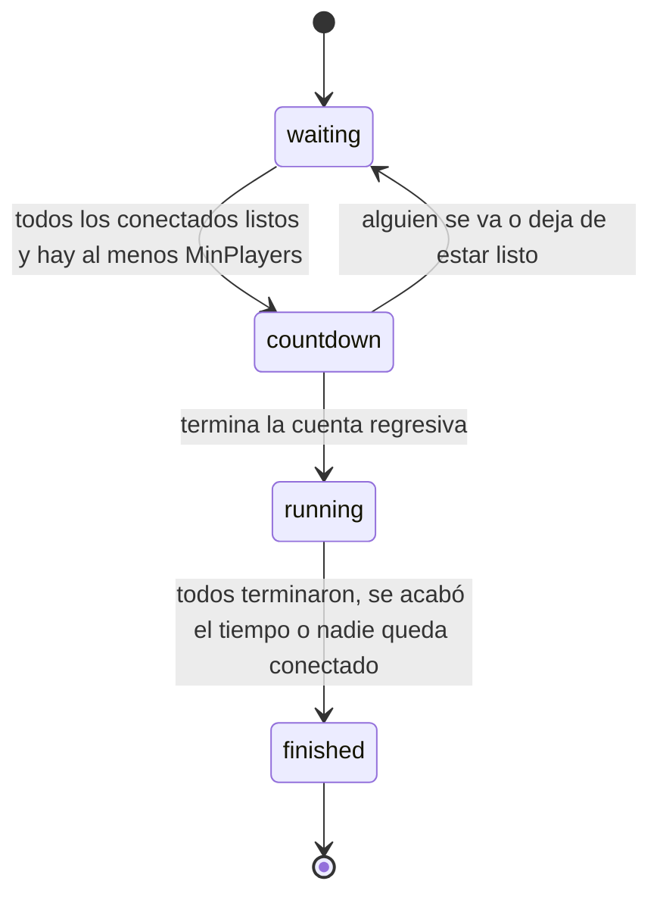

# Hub de Typing Battle (`/hubs/typing`)

Hub SignalR propio del juego, independiente del Lobby Hub de Matchmaking (`03-contratos-tecnicos.md`, sección 4). Es el contrato entre el backend y el microfrontend: si cambia algo aquí, cambia en los dos lados.

## Conexión

- URL: `http://localhost:5080/hubs/typing` en local.
- Autenticación (ver el README): un JWT de Auth0 en `accessTokenFactory`; en desarrollo local, sin Auth0, los parámetros `?dev_user=ana&dev_name=Ana` en la URL.
- Si el servidor exige un permiso (`Auth:RequiredPermission`, por ejemplo `games.typing.play`), un token sin él recibe `403` al conectar.
- El id del jugador es el claim `sub` del token. Debe coincidir con `currentUser.id` del contexto del juego, porque es el `userId` con el que luego se consulta el historial.
- Todos los nombres del JSON van en `camelCase`, las fechas en UTC con sufijo `Z` y los estados como texto (`"running"`).

```ts
import { HubConnectionBuilder } from '@microsoft/signalr';

const connection = new HubConnectionBuilder()
  .withUrl(`${apiBase}/hubs/typing`, { accessTokenFactory: () => token })
  .withAutomaticReconnect()
  .build();

connection.on('GameStarted', (e) => { /* e.text ya se puede mostrar */ });
await connection.start();
const room = await connection.invoke('JoinGame', matchId, displayName);
await connection.invoke('SetReady');
await connection.invoke('SubmitProgress', typedSoFar);
```

## Flujo de una partida



1. Cada jugador llama a `JoinGame(matchId, displayName)` y luego a `SetReady()`. El microfrontend puede hacer ambas cosas dentro de `GameModule.start()`.
2. Cuando todos los conectados están listos (y son al menos `MinPlayers`, 2 por defecto) llega `GameStarting` con la cuenta regresiva.
3. Al terminar la cuenta llega `GameStarted` con el texto. **El texto no se envía antes.**
4. Durante la carrera cada cambio se envía con `SubmitProgress(typed)`. Llegan `ProgressUpdated` y `PlayerFinished`.
5. Al terminar llega `GameFinished`. Antes de enviarlo el servidor ya guardó el resultado (ver `api-resultados.md`), así que el historial ya lo incluye.

## Métodos: cliente → servidor

Los dos argumentos de `JoinGame` son obligatorios para SignalR: si no hay nombre, envíe `null`.

| Método | Argumentos | Devuelve | Errores (`HubException`) |
|---|---|---|---|
| `JoinGame` | `matchId: string`, `displayName: string \| null` | `RoomSnapshot` | `matchId` vacío o muy largo; partida ya comenzada o terminada (si el jugador no estaba); sala llena |
| `SetReady` | — | — | no se llamó a `JoinGame` |
| `SubmitProgress` | `typed: string` | — | ninguno: se ignora si no aplica |
| `LeaveGame` | — | — | ninguno |

- `SubmitProgress` recibe **todo lo que el jugador tiene escrito**, no la última tecla. Envíelo en cada cambio; el servidor difunde a lo sumo 4 veces por segundo.
- Si la conexión se cae y `withAutomaticReconnect` la restablece, hay que volver a llamar a `JoinGame` con el mismo `matchId`: la conexión nueva no pertenece a la sala. El servidor reconoce al jugador por su `userId` y devuelve su avance (`myTyped`) y el texto.
- Solo se puede entrar a una sala mientras está en espera. Quien ya estaba puede reconectarse en cualquier momento.

## Eventos: servidor → cliente

Todos van a los jugadores de la partida (el grupo es el `matchId`). Todos los mensajes con estado traen `serverTime`; ver «Relojes».

### `RoomUpdated` → `RoomSnapshot`

Cambió la sala de espera (entró o salió alguien, cambió quién está listo). Es también lo que devuelve `JoinGame`.

```json
{
  "matchId": "match-001",
  "state": "waiting",
  "minPlayers": 2,
  "maxPlayers": 10,
  "timeLimitSeconds": 60,
  "countdownSeconds": 3,
  "players": [
    { "userId": "user-001", "displayName": "Ana", "ready": true, "connected": true,
      "progress": 0, "wpm": 0, "accuracy": 0, "finished": false, "rank": null }
  ],
  "serverTime": "2026-09-02T20:00:00Z",
  "startsAt": null, "startedAt": null, "endsAt": null,
  "textId": null, "text": null, "myTyped": null
}
```

`text`, `textId` y `endsAt` solo vienen con la carrera en curso o terminada; `myTyped` solo en la respuesta de `JoinGame` (lo que ese jugador lleva escrito).

### `GameStarting`

```json
{ "serverTime": "2026-09-02T20:00:05Z", "startsAt": "2026-09-02T20:00:08Z", "countdownSeconds": 3 }
```

Si alguien se va o deja de estar listo durante la cuenta, llega un `RoomUpdated` con `state: "waiting"`.

### `GameStarted`

```json
{
  "serverTime": "2026-09-02T20:00:08.050Z",
  "startedAt": "2026-09-02T20:00:08Z",
  "endsAt": "2026-09-02T20:01:08Z",
  "timeLimitSeconds": 60,
  "textId": "t-07",
  "text": "El café costarricense crece a la sombra de las montañas..."
}
```

### `ProgressUpdated`

Estado en vivo de todos los jugadores; solo se envía si algo cambió.

```json
{
  "serverTime": "2026-09-02T20:00:20Z",
  "players": [
    { "userId": "user-001", "displayName": "Ana", "ready": true, "connected": true,
      "progress": 42.5, "wpm": 58.3, "accuracy": 97.1, "finished": false, "rank": null }
  ]
}
```

### `PlayerFinished`

```json
{ "userId": "user-001", "rank": 1, "wpm": 62.4, "accuracy": 96.1 }
```

### `GameFinished`

```json
{
  "serverTime": "2026-09-02T20:00:47Z",
  "finishedAt": "2026-09-02T20:00:47Z",
  "winnerUserId": "user-001",
  "standings": [
    { "rank": 1, "userId": "user-001", "displayName": "Ana", "wpm": 62.4, "accuracy": 96.1,
      "progress": 100, "finished": true, "score": 600 }
  ],
  "resultSaved": true
}
```

`resultSaved` es `false` si el resultado no se pudo guardar (el servidor lo registra en el log); en ese caso el historial no lo mostrará.

## Reglas

**Quién gana.** El primero en escribir el texto completo y sin errores. Si se acaba el tiempo y nadie terminó, gana quien llegó más lejos. Si nadie escribió nada no hay ganador (`winnerUserId: null`) y no se guarda resultado.

**Clasificación.** Primero quienes terminaron, por orden de llegada; luego el resto por avance, precisión y orden de entrada a la sala.

**Fin de la carrera.** Cuando todos los jugadores **conectados** terminaron, o al cumplirse `timeLimitSeconds`, o si ya no queda nadie conectado. Un jugador desconectado no la retrasa: aparece en la clasificación con el avance que tenía.

**Cálculos** (siempre en el servidor; el cliente nunca informa su velocidad, precisión ni puntaje):

| Dato | Fórmula |
|---|---|
| Avance (`progress`) | caracteres correctos seguidos desde el inicio ÷ largo del texto × 100 |
| Velocidad (`wpm`) | (caracteres correctos ÷ 5) ÷ minutos transcurridos. Se usa como mínimo 1 s |
| Precisión (`accuracy`) | teclas correctas ÷ teclas escritas × 100. Cada carácter nuevo al final es una tecla; borrar no cuenta; un error cuenta aunque se corrija. Sin teclas: 0 |
| Puntaje (`score`) | `wpm × accuracy ÷ 100 × 10`, redondeado (60 ppm al 100 % = 600) |

Para quien termina, el tiempo es el de su llegada; para el resto, el de fin de la carrera.

**Anti-trampa.** El servidor ignora un `SubmitProgress` si el texto enviado es más largo de lo que se puede haber tecleado hasta ese momento: `35 caracteres/s × segundos transcurridos + 20`. Pegar el texto completo no sirve. Ver `adr-borradores/ADR-NNN-validacion-del-progreso-en-el-servidor.md`.

## Relojes

El reloj del navegador no coincide con el del servidor. Para el temporizador, calcule `desfase = serverTime − Date.now()` al recibir un mensaje y muestre `endsAt − (Date.now() + desfase)`.

## Configuración

Sección `Typing` de `appsettings.json`; en variables de entorno se escribe con doble guion bajo (`Typing__MinPlayers=1` para probar solo).

| Clave | Por defecto | Qué controla |
|---|---|---|
| `CountdownSeconds` | 3 | Cuenta regresiva antes del texto |
| `TimeLimitSeconds` | 60 | Duración máxima de la carrera |
| `MinPlayers` / `MaxPlayers` | 2 / 10 | Jugadores necesarios para empezar / capacidad de la sala |
| `TickMilliseconds` | 250 | Cada cuánto avanza el reloj del juego y se difunde el progreso |
| `RoomTtlSeconds` | 60 | Cuánto se conserva una sala terminada o vacía |
| `MaxCharsPerSecond` / `MaxBurstChars` | 35 / 20 | Límite anti-trampa |

## Qué pasa al terminar

1. El servidor arma el resultado (jugadores en orden de clasificación, `metadata` con el esquema de `api-resultados.md`) y lo guarda con el mismo servicio que usa `POST /api/games/typing/results`.
2. Envía `GameFinished` a los jugadores.
3. En segundo plano le avisa a Matchmaking (`Matchmaking:BaseUrl`). El contrato todavía no define cómo; ver la duda 1 de `contratos-pendientes.md`.

Las salas viven solo en memoria: si el servicio se reinicia a mitad de una carrera, esa partida se pierde. Los resultados ya guardados no.
